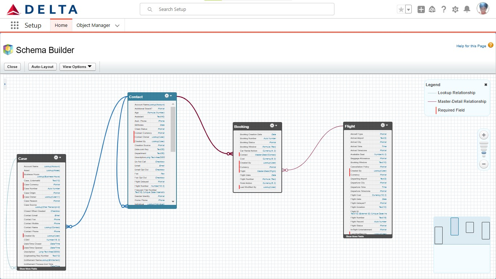

# Salesforce-Customer-Engagement-Enhancement
## Clicked Admin Sprint- Customer Engagement Enhancement for Delta Airlines.

*This implementation is not affiliated with or endorsed by Delta Airlines or any other airline. The data used in this project was randomly generated and is intended for educational and learning purposes only. Any references to Delta Airlines or its logo are purely for illustrative purposes to provide context to the learning scenario. The inclusion of the Delta Airlines logo does not imply sponsorship, partnership, or support from Delta Airlines.*

### Introduction
  
  **Objective**
  
  To implement Salesforce solutions to address Delta Airlines' challenges with fragmented systems, manual processes, and limited personalization, aiming to boost customer(Passengers) satisfaction and competitiveness.
  
  **Key Features**
  
  - Customer Portal using Salesforce Experience Cloud with live chat integration.
  - Feedback Survey in Salesforce
  - Self-Service Knowledge Base for customers
  
  **Target Users**
  
  - Delta Airlines’ customer service agents.
  - Delta Airlines customers.

### Business Use Case
  
  **Problem Statement**
  
  Delta Airlines faced challenges due to inefficient siloed systems and manual processes, leading to delays, gaps in customer/passenger interactions, and limited real-time personalization.
  
  **User Story**
  
  - **Customer Service Agent**
      
      As a **Customer Service Agent**, I want to have visibility into active marketing campaigns for customers with unresolved issues so that I can proactively handled concerns.
      
      **Acceptance Criteria**
      
      - Service agents have visibility into related marketing activities when assisting customers
      - Customers with unresolved issues are automatically excluded from receiving promotional emails until the issue is resolved
  - **Customer**
      
      As a **Customer Service Agent**, I want to have visibility into active marketing campaigns for customers with unresolved issues so that I can proactively handled concerns.
      
      **Acceptance Criteria**
      
      - Personalized offers appear based on recent searches, travel history, and loyalty status.
      - Real-time feedback loop ensures that only resolved service issues lead to follow-up offers or loyalty perks.

## Solution Design
    
  **Solution Overview**
  
  The Salesforce implementation streamlined operations by integrating systems, automating processes, and improving personalization to enhance passenger trust and engagement.
  
  **Architecture Overview**
  
  The solution includes:
  
  - **Salesforce CRM** for managing passenger data.
  - **Experience Cloud** to build the passenger portal with;
      1. Live chat enabled
      2. Salesforce Knowledge and Topics for Passenger Self-service
      3. Salesforce Feedback Survey to analyze CSAT
         
    🔴 Delta Airline Architecture Diagram
      

  

### Data Model

**Key Objects and Relationships**
| Object Name | Description | Relationships |
|----------|----------|----------|
| Contact    | Represents individual Passenger   | Linked to Booking object via a Master-detail relationship   |
| Flight  | Tracks flight related records   | Linked to Booking object via a Master-detail relationship  |
| Booking | Junction object that contains look-up fields to Contact and Flight object | Connects both the Contact and Fight object. Creates a many-to-many relationship between these objects. |
| Case | Tracks Passenger issues and resolutions | Linked to the Contact Object. |

🔴 Schema Diagram showing the relationship between Contact, Booking, Flight and Case object.

  

**Security Model**

- **User Roles**: Customer, Customer Service Agent, Admin.
- **Profiles and Permissions**:
    - Customers: View access to the portal and live chat.
    - Agents: Full access to customer cases and marketing activity visibility

### Implementation Details
    
  **Configuration**
  
  - **Experience Cloud**: Configured the customer portal with intuitive navigation and live chat functionality.
  - **Knowledge base:** Implemented knowledge base topics and articles for customer self-service to increase case deflection, reducing workload for service agents.
  - **Salesforce Survey:** Implemented Salesforce Surveys to capture customer feedback after each live chat interaction with an agent, enabling analysis of Customer Satisfaction (CSAT).

  ### Lessons Learned
    
  **Challenges Faced**
  
  - Ensuring seamless integration between siloed systems and marketing tools.
  
  **What I Learned**
  
  - Deepened understanding of Salesforce Experience Cloud and External user profile configuration
  - Improved skills in creating customer-centric solutions that enhance engagement.

### Tools and Technologies Used
  - **Salesforce CRM**
  - **Salesforce Experience Cloud**
  - **Salesforce Survey**

### Connect with Me

:linkedin: [www.linkedin.com/in/oyinfunke](http://www.linkedin.com/in/oyinfunke)

:calendly: [Take a Virtual Coffee with me](https://calendly.com/oyinfunke7/quick-chat)

:mail: [oyinfunke7@gmail.com](mailto:oyinfunke7@gmail.com)

